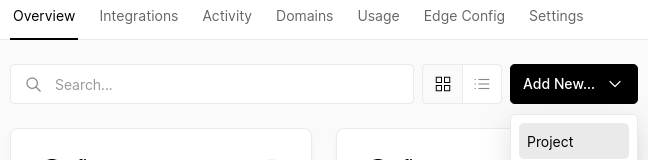
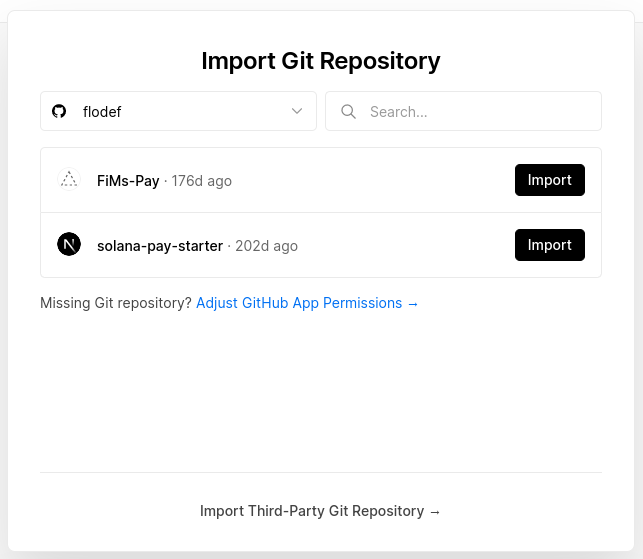
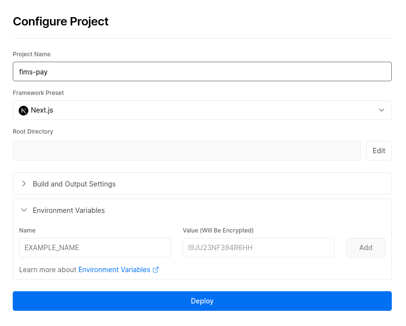
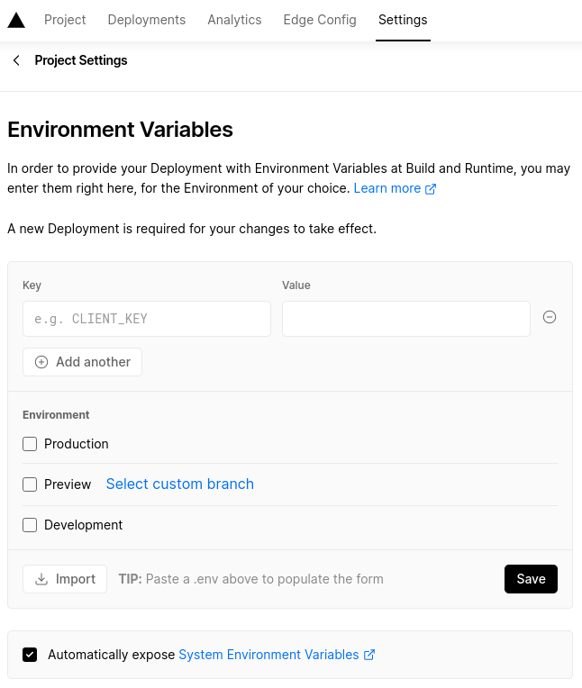

# What is FiMs Pay ?


**FiMs Pay** is a fully customisable web app, that can be use as a Point Of Sale by a merchant, or directly as a Customer Payment app.
The app requires pre-registered merchants, but can also be used on-the-fly by directly entering one's merchant infos (name, Solana wallet address, currency accepted and maximum value).
Use the code as a reference, or run it yourself to start accepting decentralized payments in-person.

## Advantages / Functionalities
-    Usable all over the world, translated in many languages: English, Spanish, Portuguese, French, Japanese and Esperanto
-    Accepts a lot of currencies: agEUR, Euro, USDC, USDT, SOL and even BONK
-    Private payments with Elusiv
-    Select your favorite theme: classic, color or black & white
-    Maximum value to avoid having a small shop accepting a huge amount
-    Custom RPC
-    Compatible with Mobile Wallet Adapter
-    Use Transfer or Transaction Request
-    Full Configuration in an Environment settings file or in a Google Spreadsheet
-    Custom Faucet / Onramp link and about page / website

## Point of Sale

This Point of Sale use the `@solana/pay` JavaScript library to create a simple point of sale system, yet usable in a shop!
The merchant use the Point of Sale on its device (tablet / computer / phone) and set the amount to receive.
The customer will then scan a QR code and validate the transaction on its phone.

-    [Check out the app](https://demo.fims.fi?currency=USDC&maxValue=99999.99&recipient=5uXKZWCYbaKwFMwu9BxMGEYowbhuG34qqYkg36hL5YvG&label=FiMs+Pay💕), inspired by Solana's Proof of Concept version. 
-    Try a [customised version](https://pos.fims.fi)
-    Watch a [real life video](https://www.youtube.com/watch?v=oBDJEQpiLws)

## Customer Direct Payment

If the merchant does not have a point of sale and just want to receive payments, it would have to redirect its customers to the customer direct payment web app on its mobile phone:

-    Try paying directly [here](https://pay.fims.fi)
-    Check out a [quick demo](https://www.youtube.com/shorts/tpYBaOLsnAo)
-    Watch a [real life video](https://www.youtube.com/watch?v=uTertz4la2I)

## Preview

Responsive (PAY)                               |  Desktop (POS)
:---------------------------------------------:|:---------------------------------------------:
 | 

# Customising / Playing with the app

## Prerequisites

To build and run this app locally, you'll need:

-   Node.js v18 or above
-   NPM / Yarn
-   <details>
        <summary> Setup two wallets on <a href="https://solflare.com/download">Solflare</a> or <a href="https://phantom.app">Phantom</a> (Merchant and Customer) </summary>

    ### 1. Create merchant wallet

    Follow the [guide][0] (Solflare) or [guide][1] (Phantom) on how to create a wallet. This wallet will provide the recipient address.

    ### 2. Create customer wallet

    Follow the [guide][0] (Solflare) or [guide][1] (Phantom) on how to create another wallet. This wallet will be paying for the goods/services.

    ### 3. Set a wallet to connect to devnet

    ### a. Solflare

    1. Click the settings icon in the Phantom window
    2. Under the `General > Network` setting, select `Devnet`

    ### b. Phantom

    1. Click the settings icon in the Phantom window
    2. Select the `Change network` option and select `Devnet`

    ### 4. Airdrop SOL / SPL token to customer and merchant wallet

    Use [solfaucet][2] or [solfaucet][3] to airdrop SOL to the customer wallet and merchant wallet.
    Alternatively, if you need USDC_Dev (a dev version of USDC), use this [SPL token faucet][4].

    > You'll need SOL in the customer wallet to pay for the goods/services + transaction fees.
    > You'll also need SOL in the merchant wallet to indicate that this wallet is active.
    > If you are using a SPL token (any token different than SOL), you'll need to first create a SPL token account in the merchant wallet.

 </details>

## Getting Started

These instructions will get you a copy of the project up and running on your local machine for development and testing purposes.

### Clone the repository

#### With Git
```shell
git clone https://github.com/flodef/FiMs-Pay.git
```

#### With Github CLI
```shell
gh repo clone flodef/FiMs-Pay
```

### Install dependencies
```shell
cd FiMs-Pay/
npm install
```

### Tweek the settings
Make a copy of the setting example in order to set your own:
```shell
cp .env.example .env.local
```

To run the program in dev, change at least the setting and set it to ```NEXT_PUBLIC_IS_DEV=true```
A complete list of the available settings is available at the end of the page.

### Start the local dev server
```shell
npm run dev
```

### In a separate terminal, run a local SSL proxy
```shell
npm run proxy
```

### Open the Point of Sale app
```shell
open "https://localhost:3001"
```
You may need to accept a locally signed SSL certificate to open the page.

Alternatively, you can go straight to the point of sale, by adding at least one of the following info: 
-   a merchant address (recipient): should be a valid solana wallet address
-   a store name (label): can be any name
-   a currency (currency): should be one of the accepted currency (currently USDC, USDT, agEUR, EUR, SOL and BONK)
-   a max value (maxValue): can be any number
You can specify a parameter by adding it at the end of the web address.

---

> **Notes**
> Between the web address and the first parameter, a `?` should be added.
> Between a parameter and its value, a `=` should be added.
> Between the two parameters, a `&` should be added.
> Because space character is not allowed in a web address, replace all spaces by a `+`.

---

Example: 
```shell
open "https://localhost:3001?recipient=Your+Merchant+Address&label=Your+Store+Name&currency=BONK&maxValue=2"
```

## Accepting other SPL Token on Mainnet
Find and download the SPL Token icon as a .svg
Put the file in the [`client/images`](https://github.com/flodef/FiMs-Pay/blob/master/src/client/images) folder.
Open the file as a text and copy the svg code to create a Function Component. 
To do so, go into the [`client/components/images`](https://github.com/flodef/FiMs-Pay/blob/master/src/client/components/images) folder.
If you don't feel inspired to create one on your own, just make a copy of ```SOLIcon.tsx```, rename it to your SPL Token name, and modify the following lines:
```tsx
export const SOLIcon: FC<SVGProps<SVGSVGElement>> = ({ width = 32, height = 32 }) => {
    return (
        <svg
            width={width}
            height={height}
            fill="none"
            viewBox="0 0 84 84"
            xmlns="http://www.w3.org/2000/svg"
            xmlnsXlink="http://www.w3.org/1999/xlink"
        >
```
> Change ```SOLIcon``` to your SPL Token name (eg: BONKIcon for $BONK).
> Replace the Function Component ```<svg></svg>``` by your own.  
> Make sure the ```width``` and ```height``` are accepting JSX parameters (should be between brackets `{ }`).

Find your token info on a Solana Explorer, for example [Solscan](https://solscan.io/):
-    Token name 
-    Token Symbol (the label written between parenthesis next to Token Name)
-    Token address
-    Decimals

Add your token info in the [`client/utils/constants.ts`](https://github.com/flodef/FiMs-Pay/blob/master/src/client/utils/constants.ts) file:
1. Import your created Function Component Icon created in the previous step (replace 'TOKEN_NAME' by your Token name):
```tsx
import { TOKEN_NAMEIcon } from '../components/images/TOKEN_NAMEIcon';
```
2. Create a Public Key from the Token address:
```tsx
const MAINNET_TOKEN_NAME_MINT = new PublicKey('Token_Address');
```
3.  Add your token to the currency list:
```tsx
export const CURRENCY_LIST: currencyType = process.env.NEXT_PUBLIC_IS_DEV === 'true'
    ? {
        SOL: { splToken: undefined, icon: SOLIcon, decimals: 9, minDecimals: 1, symbol: '◎' },
        USDC_Dev: { splToken: DEVNET_DUMMY_MINT, icon: USDCIcon, decimals: 6, minDecimals: 2, symbol: 'USD' },
    }
    : {
        SOL: { splToken: undefined, icon: SOLIcon, decimals: 9, minDecimals: 1, symbol: '◎' },
        //...
        BONK: { splToken: MAINNET_BONK_MINT, icon: BONKIcon, decimals: 5, minDecimals: 2, symbol: 'BONK', multiplier: Multiplier.M }
    };
```

The parameters should be filled like this:
-   splToken: the Public Key created in step 2,
-   icon: the Icon imported in step 1,
-   decimals: the decimals number retrieved on the Solana Explorer,
-   minDecimals: the minimum number of decimals needed,
-   symbol: the token symbol retrieved on the Solana Explorer,
-   multiplier: a multiplier in case the currency has a very small / high valuation price (for example, if 1 Million $BONK = $1, it can make sense to use a Million high multiplier to avoid typing too much 0. Reversely, if 1 $Bitcoin = $100 000, you can use a small multiplier like using Satoshi conversion). Multiplier is optional and can be found in the [`client/utils/multiplier.ts`](https://github.com/flodef/FiMs-Pay/blob/master/src/client/utils/multiplier.ts) file.

Once done, you should see your new added token in the home page Token list. It also can be directly selected by adding the ```currency=TokenName``` parameter in the web address.

## Using Transaction Requests

[Transaction Requests](../SPEC.md#specification-transaction-request) are a new feature in Solana Pay.

In the settings file (.env.local), set ```NEXT_PUBLIC_USE_LINK=true```

The generated QR codes in the app should now use transaction requests. To see what's going on and customize it, check out the [`server/api/index.ts`](https://github.com/flodef/FiMs-Pay/blob/master/src/server/api/index.ts) file.

## Deploying to Vercel

You can deploy this point of sale app to Vercel with a few clicks.

### 1. Fork the project

Fork the Solana Pay repository

### 2. Login to Vercel

Login to Vercel and create a new project



Import the forked repository from GitHub.



> If you're forked repository is not listed, you'll need to adjust your GitHub app permissions. Search for the app permission in the project's repository settings.

### 3. Configure project

Configure the project as follows:



---

> **Notes**
> At this step, you can set up manually any settings in `Environment Variables` that are in your `.env.local` file. 
However, I would recommend to wait for the build to deploy and follow the next step...

---

### 4. Import your settings

To import settings, go to `Settings` then `Environment Variables`.
Settings in `.env.local` file can be imported one by one, or in one go.
To copy one setting at the time, copy a setting line and paste it directly the `Key` text box (for example ```NEXT_PUBLIC_IS_DEV=true```). It will automatically copy the parameter properly.
If you want to import the whole `.env.local` file, imports all your settings in one go by clicking on `Import` then selecting the file and finally click on `Save`.



---

> **Notes**
>-   You can click `select custom branch` if you want your settings to only apply to a specific branch. `Production` is set to your master branch (the branch by defaults). 
>-   Once a setting is changed, you'll have to `Redeploy` your project.

---

### 5. Deploy project

Once the deployment finishes, enjoy by navigating to:

```
https://<YOUR DEPLOYMENT URL>
```

## Settings / Environment Variables

Here is the list of all availables settings with their explanation and default value (if not set):
-   NEXT_PUBLIC_CLUSTER_ENDPOINT=https://solana-mainnet.rpc.extrnode.com : The RPC address to the server that will execute all the request to the Solana network.
-   RATE_LIMIT=10 : Number of RPC requests that can be sent during a specific interval (RATE_LIMIT_INTERVAL).
-   RATE_LIMIT_INTERVAL=60 : Number of seconds to define the interval during which a number of requests can be sent (RATE_LIMIT).
-   IMAGE_DOMAIN=flodef.github.io : Domain Address where images are stored (used by Next.JS to cache and improve loading performances).
-   NEXT_PUBLIC_CURRENCY=SOL : Default currency used (Possible value can be : EUR, agEUR, USDC, USDC_Dev, USDT, SOL, BONK).
-   NEXT_PUBLIC_MAX_VALUE=99999.99 : Default maximum value a merchant can receive as a payment (for example, a bakery won't probably never be paid more than $1000.
-   NEXT_PUBLIC_IS_CUSTOMER_POS=false : Whether the app display a Customer POS (if the merchant does not have its own POS, it's possible to use this option to pay directly and show the merchant the validation info once paid).
-   NEXT_PUBLIC_POS_USE_WALLET=false : Whether the POS needs to connect a wallet to get it's address / balance, or simply uses an address to get payments to.
-   NEXT_PUBLIC_SHOW_MERCHANT_LIST=false : Whether a list of predefined merchants should be shown or a more advanced menu to enter one's own merchant infos
-   NEXT_PUBLIC_SHOW_SYMBOL=false : Whether to show the currency's symbol or its name (for example, SOL currency's name is SOL and symbol's ◎, as well USDC's symbol would be $).
-   NEXT_PUBLIC_IS_DEV=false : Whether the Solana Network used is Devnet or Mainnet .
-   NEXT_PUBLIC_USE_HTTP=false : Whether the Web protocol used is HTTP or HTTPS (in dev, HTTPS needs a proxy to run in background while HTTP do not).
-   NEXT_PUBLIC_USE_LINK=false : Whether to use Transaction Requests (true) or Transfer Requests (false).
-   NEXT_PUBLIC_USE_WEB_WALLET=false : Whether to connect to a Web wallet first or use Mobile Wallet Adapter.
-   NEXT_PUBLIC_AUTO_CONNECT=false : Whether to connect automatically when the application starts or wait for the user interaction.
-   NEXT_PUBLIC_DEFAULT_WALLET : The default wallet to connect to (for example, if you know all of your customers are only using one wallet).
-   NEXT_PUBLIC_APP_TITLE=FiMs Pay : The app default title, that will be displayed in the web page and use as default merchant label.
-   NEXT_PUBLIC_DEFAULT_LANGUAGE=en : The app default language if the browser language is not found as a translated language (currently, english, esperanto, spanish, french, japanese and portuguese).
-   NEXT_PUBLIC_GOOGLE_SPREADSHEET_ID : The Google Spreadsheet ID to load data from (if not specified, data will be loaded from the [`server/data`](https://github.com/flodef/FiMs-Pay/blob/master/src/server/data) folder).
-   NEXT_PUBLIC_GOOGLE_API_KEY : The Google API key allowing to connect to a Spreadsheet.
-   NEXT_PUBLIC_MERCHANT_IMAGE_PATH='/Img/Merchant/' : The path or Web address to where the merchant's logo is located
-   NEXT_PUBLIC_FAUCET=https://spl-token-faucet.com : A web address to a SOL / SPL Token faucet 
-   NEXT_PUBLIC_ABOUT=https://solanapay.com/ : A web address to know more about the app / project
-   NEXT_PUBLIC_PRIVATE_PAYMENT : Whether to use Private payments or not

## Private Payments

Private Payments are provided by Elusiv. Elusiv is a privacy solution using ZK technology with an off-chain “Warden Network” to create private transactions. 
You can read more about it on their website: https://elusiv.io/

In order to use Elusiv ZK private payments, you'll be asked to sign a message with your Solana wallet.

---

> **Notes**
>- Currently only working in localhost because Elusiv Warden Network is based on HTTP requests which the browser blocks
>- Elusiv is only available on devnet currently - our app interacts with devnet

---


## Merchants

### Single merchant

If you want to use the app for a single merchant, I would recommend to use a web address link, accessible from the mobile / desktop device as a shortcut.
For example, go to https://pos.fims.fi?currency=USDC&maxValue=99999.99&recipient=5uXKZWCYbaKwFMwu9BxMGEYowbhuG34qqYkg36hL5YvG&label=FiMs+Pay💕
Then change the label and recipient parameters with your own.
Finally, create a shortcut to access it in one click.

### Multiple merchants

#### JSON file

If you have multiple shops / multiple locations, you can simply edit the [`server/data/merchant.json`](https://github.com/flodef/FiMs-Pay/blob/master/src/server/data/merchant.json) file :
-   index : an unique id number to identify the merchant
-   address : the Solana wallet address of the merchant
-   company : the merchant's / shop's name
-   currency : the currency used
-   maxValue : the maximum value that can be received with one payment
-   location : the merchant's / shop's location

```json
{
    "values": [
        ["index", "address", "company", "currency", "maxValue", "location"],
        [2, "GZLPJYkR3diD8c8vpgb7sXHEH9sG1R9sWa3yPwaL9Peb", "Le pain d'Annette", "EUR", 300, "Saint-Nic"],
        // ...
    ]
}
```
---

> **Notes**
> Don't delete the first row `["index", "address", "company", "currency", "maxValue", "location"],` as it's mandatory.

---

#### Google Spreadsheet

JSon file is pretty strait forward to edit. However, it's not flexible because everytime you want to add / delete / modify a merchant, you have to commit to github and deploy a new version of your project on Vercel.
To avoid it, you can use an online spreadsheet containing all the merchant's information. Any modification will be live updated in the app. 

1. Go to https://drive.google.com/ and create an account if you don't have one.
2. Add a New spreadsheet: `+ New > Google Sheets > Blank Spreadsheet`
3. Change the spreedsheet's sheet name from `Sheet1` to `merchant`
4. Insert the merchant's info (first row is mandatory):
```
index	address	company	currency	maxValue	location
2	GZLPJYkR3diD8c8vpgb7sXHEH9sG1R9sWa3yPwaL9Peb	Le pain d'Annette	EUR	300	Saint-Nic
```
5. Share the Spreadsheet by going to `File > Share > Share with others` then change the share settings from `Restricted` to `Anyone with the link` and click `Done`
6. Copy the Spreadsheet GUID from the Spreadsheet web address (for example, in https://docs.google.com/spreadsheets/d/1uX6hJ3xa3ZuOzXrGYDR9XckoeAhjJXdAobZcs18VQw4/, the GUID is `1uX6hJ3xa3ZuOzXrGYDR9XckoeAhjJXdAobZcs18VQw4`) and Paste it in your `.env.local` settings file and / or in Vercel's Environment Variables under `NEXT_PUBLIC_GOOGLE_SPREADSHEET_ID` (for example, `NEXT_PUBLIC_GOOGLE_SPREADSHEET_ID=MY_SPREADSHEET_ID`).
7. Go to https://console.cloud.google.com/
8. Click on `Select a Project` then `New Project`
9. In the Navigation Menu (top left button), go to `APIs & Services > Credentials`
10. Click on `+ CREATE CREDENTIALS` then `API Keys`
11. Copy your new created API key and Paste it in your `.env.local` settings file and / or in Vercel's Environment Variables under `NEXT_PUBLIC_GOOGLE_API_KEY` (for example, `NEXT_PUBLIC_GOOGLE_API_KEY=MY_API_KEY`).

---

> **Notes**
>-   Never give your API Key to anybody untrusted as it can be used against you. 
>-   To avoid this, you can restrict your key by clicking on it in the `APIs & Services` dashboard, then use Application Restrictions or API Restrictions (at least, tick `Google Sheets API`) then `Save`
>-   You should also never commit it on Github in `.env.example` (`.env.local` file always stays on your device, and Vercel's Environment Variables are encrypted by default).

---

## Languages

As of today, the app has been translated in english, esperanto, spanish, french, japanese and portuguese.
That's already great, but we can do better...

Please, feel free to add your own language in the [`locales`](https://github.com/flodef/FiMs-Pay/blob/master/locales) folder.
To do so, copy the `en` folder and rename it to your language own ISO 639-1 code [5].
Then use the json format provided, where you need to translate the right text part (for example, ```"merchants": "List of Merchants"``` where `merchants` is the immuable id and `List of Merchants` is the translation).

I would be very happy to receive your translated texts and add it to the project. In that case, kindly send a Pull Request ;-)

## License

The Solana Pay Point of Sale app is open source and available under the Apache License, Version 2.0. See the [LICENSE](./LICENSE) file for more info.

<!-- Links -->

[0]: https://docs.solflare.com/solflare/
[1]: https://help.phantom.app/hc/en-us/articles/4406388623251-How-to-create-a-new-wallet
[2]: https://sol-faucet.avaulto.com/
[3]: https://solfaucet.com/
[4]: https://spl-token-faucet.com/
[5]: https://en.wikipedia.org/wiki/List_of_ISO_639-1_codes
